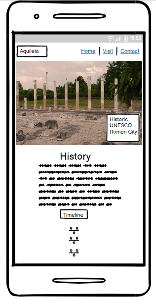
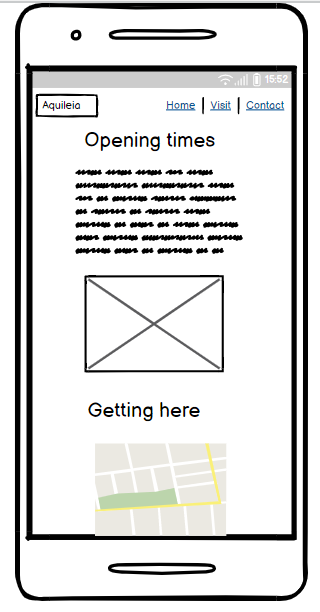
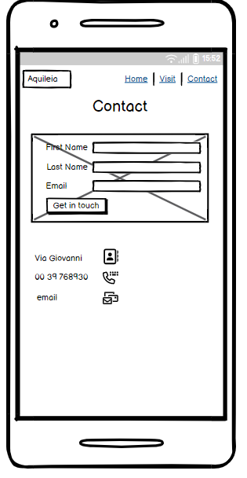
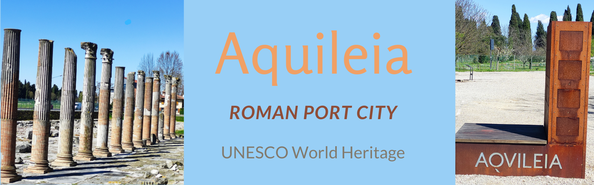
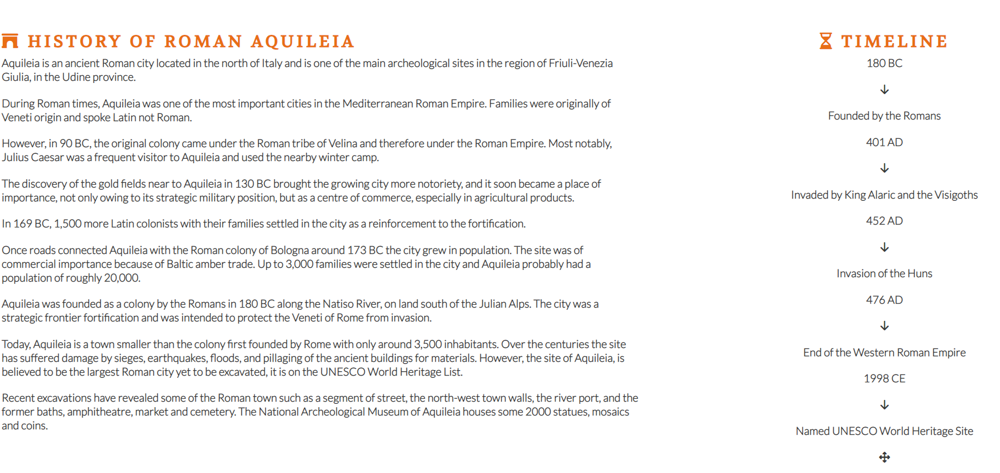
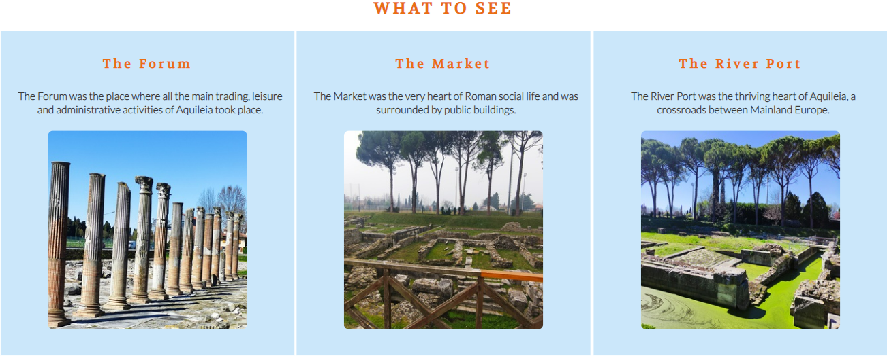
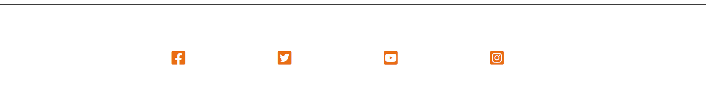
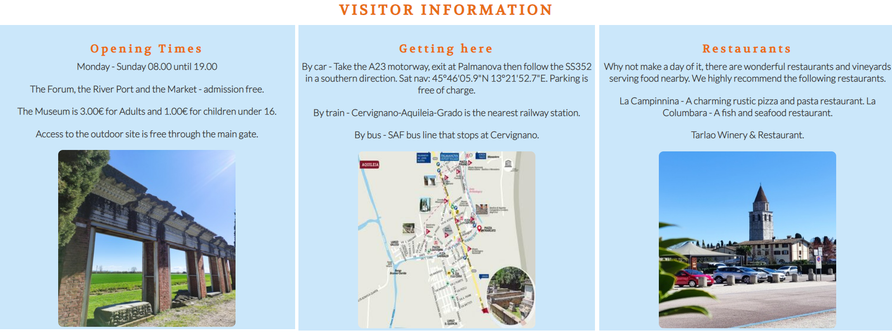
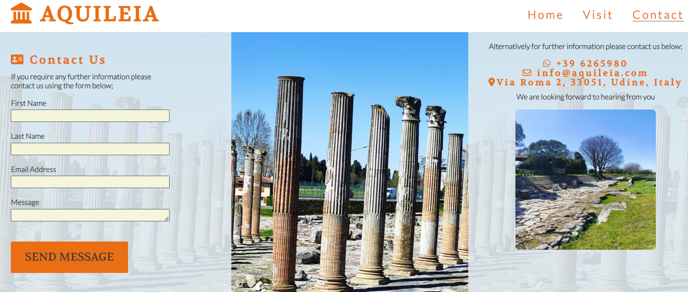

# Aquileia Roman Port City

A website to attract and inform visitors of the historic Roman UNESCO site of Aquileia, Fruili-Venezia Guilia, Italy.

## Portfolio Project 1 - Estelle Specht

[Live Site](https://8000-estii20-aquileiaromanci-jh99q20ifjj.ws-eu94.gitpod.io/index.html) 

[Link](https://ui.dev/amiresponsive?url=https://estii20.github.io/aquileia-roman-city/)

## Table of contents

1. UX Design
2. Features
3. Future Features
4. Technology Used
5. Accessibility
6. Testing
7. Deployment
8. Credits
9. Acknowledgements

### UX Design

To attract English speaking visitors to the UNESCO Roman City in Aquileia. It was one of the most important cities in the Roman Empire.
Visitors have the opportunity to see the key historic sites of the Roman Forum, the River Port, the main square and Ancient Necropolis. The historical information is next to the images to provide a cohesive structure.
A timeline offers users an easy to read timeline detailing key important dates.

The purpose of the website is to provide visitors information so that they can plan their visit in advance. There is a map of the area, the contact details, admission price, opening times and a contact form for any further information.

The primary user of the site will be English speaking visitors to the region. For visitors to the major cities of Venice and Trieste, Aquileia is ideally suited for those visitors venturing further afield who have an interest in historic, namely Roman culture. The site is very well maintained and much of the architecture is complete in structure. Aquileia is a rare and beautiful UNESCO heritage site.
The user will be able to plan an overnight visit, to really take in the full beauty of the site.

 __Aims__

- To offer visitors the opportunity to experience this rare historic cultural Roman archeology.
The site itself is close to me and I am very passionate about this period of history.

- To give visitors all the information they need to enjoy their time in the region

- To promote the area in general. Aquileia is very close to the major tourist cities of Venice and Trieste and many tourists do not know about the area.

- Provide high quality images of the Roman architecture.

- The navigation will be minimalistic to create clear intuitive prompts to the user.

- To contain useful information for the visitor/user.

- To detail historic information so that the user can understand what is on offer at the site.

- To include a timeline with key data and dates about the historic site.

- Further to provide a contact form for visitors to get in touch.

- To offer a map of the location, with information on how to get to Aquileia by car and public transport.

- To provide information about access to the Roman site.

- To give arrival information such as car parking, admission price and opening times.

- Links in the footer to the social media platforms will be provided.

- Finally a call to action visitor contact form for those users requiring further visitor information.

__Skeleton__

Webpage and mobile version made using [Balsamiq](https://balsamiq.cloud/skgv95c/pk5rjyb)

__Surface__

To create a clear visual guide to the user to promote the history of the site.

__Background Color__

Header and Footer both use #e96e14, a golden orange color to complement the Italian imagery palette selected from the hero image aided by [eyedropper tool Chrome extension](https://chrome.google.com/webstore/detail/eye-dropper/hmdcmlfkchdmnmnmheododdhjedfccka?hl=pt).
Body uses a background color white #fafafa to contrast well with the charcoal font-color #3a3a3a. Used the color light blue rgb(222, 233, 238, 0.9) with opacity to draw the reader's attention to the content without distracting from the information. The color was chosen for the background to compliment the colors of the sky in the images used.

[Colorspace](https://mycolor.space/) used to check the palette works together. 

__Font Color__

H1, h2 and h3 headings used the color #e96e14 to complement the logo.
The body text used the #3a3a3a to enable easy viewing for the reader against the background therefore the text stood out well without causing the reader to strain to read it. 

__Border Color__

The border color charcoal #3a3a3 used to compliment the body font color.

__Form Color__

The Contact form uses the background of light beige rgb(222, 233, 238, 0.9) to contrast with the background image of The Forum, the input fields are beige to make the content text input area stand out on the background. The border color again uses the color charcoal #3a3a3a.

__Fonts__

- Volkhov font is used for headings and the logo to style them to the roman topic of the website. The font Lato used for the body text to give a clean look for the user.

- Used [fontjoy](https://fontjoy.com/) to find the font for the logo and headings.

- Fonts imported from [Google Fonts](https://fonts.google.com/).

- [Font Awesome](https://fontawesome.com/) used to add visual cues to the logo, headings, contact information, social media and timeline.

### Features

__Homepage__

- Header with Logo and Navigation Links
- Historical information and Timeline
- What to see section, showing The Forum, The Port and The Market
- Footer with associated social media links

The heading section has a Logo with font awesome museum image and a Navigation bar with 3 links. The use of CSS Float enables the navigation bar to appear in the correct order.

__Hero Image__

Created in canva and features the main image of Aquileia as you enter the ruins. The columns are particularly recognised at the site.

__Historical information and Timeline with key dates__

The History section details the key information about the Roman site. To the right of the history section is a Timeline created using font awesome arrows to give the effect of a transfer between dates and key points about the site's history.

__What to see section__

Features The Forum, The Market and The River Port
Each features an image of what to see at each area of the site.

All images have alt text labels to help with the accessibility of the website.

__Footer with links to the Social Media platforms__

Links to the main social media are used and are centered within the footer.
The links are colored to compliment the Logo and headers.
Links have been given aria labels to help with user accessibility, they open in a separate window so the user can navigate easily between sites.

### Visit Page

- Header with Logo and Navigation Links
- Opening times
- Accessibility information
- How to get there by car, train and bus
- Admissions
- Information about local restaurants
- Images of Roman Arch, Map of Aquileia and nearby restaurant.
- Footer with links to the Social Media platforms

__Visit section__

This section helps the user plan a visit to Aquileia.

The first paragraph gives admission and opening times.
The second paragraph details how to get to Aquileia by car, train and bus.
Lastly there is a recommendation for local restaurants to encourage visitors to extend their stay.

Images and a map are added to inform the user further.

### Contact Page

- Header with Logo and Navigation Links
- Background image of Roman Columns
- Phone
- Email
- Address
- Contact form for further information
- Footer with links to the Social Media platforms

The form uses the elements - First Name, Last Name, Email Address, Message, and submit message button. 

The fields are all required to have text entered in the correct format. 

The send message button is styled to encourage the user to submit a message. The hover pseudo class reverts the color from # to white to show that the button is active to the user. 

The Form connects to the Code Institute Form test site.

Information on alternative methods to contact Aquileia by email and phone are listed.

