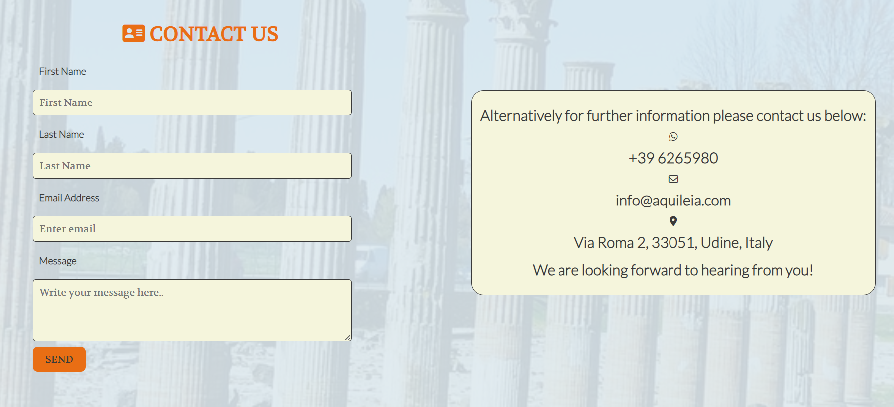

# Aquileia Roman City

A website to attract and inform visitors of the historic Roman UNESCO site of Aquileia, Fruili-Venezia Guilia, Italy.

## Portfolio Project 1 

[Live Site](https://estii20.github.io/aquileia-roman-city/) 

[Website Mock-up](https://ui.dev/amiresponsive?url=https://estii20.github.io/aquileia-roman-city/)

## Table of contents

1.  [UX Design](#ux-design)
2.  [Features](#features)
3.  [Future Features](#future-features)
4.  [Technology Used](#technology-used)
5.  [Accessibility Features](#accessibility-features)
6.  [Testing](#testing)
7.  [Bugs and Fixes](#bugs-and-fixes)
8.  [Unfixed Bugs](#unfixed-bugs)
9.  [Deployment](#deployment)
10. [Credits](#credits)
11. [Acknowledgements](#acknowledgements)

## UX Design

To attract English speaking visitors to the UNESCO Roman City in Aquileia. It was one of the most important cities in the Roman Empire.
Visitors have the opportunity to see the key historic sites of the Roman Forum, the River Port and the main Market square. The historical information is next to the images to provide a cohesive structure.
A timeline offers users an easy to read timeline detailing key important dates.

The purpose of the website is to provide visitors information so that they can plan their visit in advance. There is a map of the area, the contact details, admission price, opening times and a contact form for any further information.

The primary user of the site will be English speaking visitors to the region. For visitors to the major cities of Venice and Trieste, Aquileia is ideally suited for those visitors venturing further afield who have an interest in historic, namely Roman culture. The site is very well maintained and much of the architecture is complete in structure. Aquileia is a rare and beautiful UNESCO heritage site.
The user will be able to plan a visit, to really take in the full beauty of the site.

 __Aims__

- To offer visitors the opportunity to experience this rare historic cultural Roman archeology.
The site itself is close to me and I am very passionate about this period of history.

- To give visitors all the information they need to enjoy their time in the region

- To promote the area in general. Aquileia is very close to the major tourist cities of Venice and Trieste and many tourists do not know about the area.

- Provide high quality images of the Roman architecture.

- The navigation will be minimalistic to create clear intuitive prompts to the user.

- To contain useful information for the visitor/user.

- To detail historic information so that the user can understand what is on offer at the site.

- To include a timeline with key data and dates about the historic site.

- Further to provide a contact form for visitors to get in touch.

- To offer a map of the location, with information on how to get to Aquileia by car and public transport.

- To provide information about access to the Roman site.

- To give arrival information such as car parking, admission price and opening times.

- Links in the footer to the social media platforms will be provided.

- Finally a call to action visitor contact form for those users requiring further visitor information.

__Skeleton__

Webpage and mobile version made using [Balsamiq](https://balsamiq.cloud/skgv95c/pk5rjyb).

__Surface__

To create a clear visual guide to the user to promote the history of the site.

__Background Color__

Header and Footer both use ` #e96e14 `, a golden orange color to complement the Italian imagery palette selected from the hero image aided by the [eyedropper tool Chrome extension](https://chrome.google.com/webstore/category/extensions).
Body uses a background color white ` #fafafa ` to contrast well with the charcoal font-color ` #3a3a3a `. Used the color light blue ` rgb(152, 207, 246, 0.5) ` with opacity to draw the reader's attention to the content without distracting from the information. The color was chosen for the background to compliment the colors of the sky in the images used.

[Colorspace](https://mycolor.space/) used to check the palette works together. 

__Font Color__

H1, h2 and h3 headings used the color ` #e96e14 ` to complement the logo.
The body text used the ` #3a3a3a ` to enable easy viewing for the reader against the background therefore the text stood out well without causing the reader to strain to read it. 

__Border Color__

The border color charcoal ` #3a3a3a ` used to compliment the body font color.

__Form Color__

The Contact form uses the background of light beige ` rgb(222, 233, 238, 0.9) ` to contrast with the background image of The Forum, the input fields are beige ` #F5F5DC ` to make the content text input area stand out on the background. The border color again uses the color charcoal ` #3a3a3a `.

__Fonts__

- Volkhov font is used for headings and the logo to style them to the roman topic of the website. The font Lato used for the body text to give a clean look for the user.

- Used [fontjoy](https://fontjoy.com/) to find the font for the logo and headings.

- Fonts imported from [Google Fonts](https://fonts.google.com/).

- [Font Awesome](https://fontawesome.com/) used to add visual cues to the logo, headings, contact information, social media and timeline.

## Features

__Homepage__

- Header with Logo and Navigation Links
- Historical information and Timeline
- What to see section, showing The Forum, The Port and The Market
- Footer with associated social media links

The heading section has a Logo with font awesome museum image and a Navigation bar with 3 links. The use of CSS Float enables the navigation bar to appear in the correct order.

__Hero Image__

Created in canva and features the main image of Aquileia as you enter the ruins. The columns are particularly recognised at the site.

__Historical information and Timeline with key dates__

The History section details the key information about the Roman site. To the right of the history section is a Timeline created using font awesome arrows to give the effect of a transfer between dates and key points about the site's history.

__What to see section__

Features The Forum, The Market and The River Port.
Each features an image of what to see at each area of the site.

All images have alt text labels to help with the accessibility of the website.

__Footer with links to the Social Media platforms__

Links to the main social media are used and are centered within the footer.
The links are colored to compliment the Logo and headers.
Links have been given aria labels to help with user accessibility, they open in a separate window so the user can navigate easily between sites.

__Visit page__

- Header with Logo and Navigation Links
- Opening times
- Accessibility information
- How to get there by car, train and bus
- Admissions
- Information about local restaurants
- Images of Roman Arch, Map of Aquileia and nearby restaurant.
- Footer with links to the Social Media platforms

__Visit section__

This section helps the user plan a visit to Aquileia.

The first paragraph gives admission and opening times.
The second paragraph details how to get to Aquileia by car, train and bus.
Lastly there is a recommendation for local restaurants to encourage visitors to extend their stay.

Images and a map are added to inform the user further.

__Contact page__

- Header with Logo and Navigation Links
- Background image of Roman Columns
- Phone
- Email
- Address
- Contact form for further information
- Footer with links to the Social Media platforms

The form uses the elements - First Name, Last Name, Email Address, Message, and submit message button. 

The fields are all required to have text entered in the correct format. 

The send message button is styled to encourage the user to submit a message. The hover pseudo class reverts the color from to white ` #fafafa ` to show that the button is active to the user. 

The Form connects to the Code Institute Form test site.

Information on alternative methods to contact Aquileia by email and phone are listed.

## Future Features

It would be helpful in the future to link the map to google maps using Javascript.
Further languages such as German and Spanish could be added to the site for non-English speakers.
The Visit section could be updated to feature sponsored links to the restaurants listed. Therefore raising user experience and also revenue for the website.

## Technology Used

__HTML__

Provides structure to the content

__CSS__

Provides style to the content and user accessibility. Media queries to adjust to different screen sizes.

__Font Awesome__

[Font Awesome](https://fontawesome.com/) provides visual cues to the user on the pages and was used for the social media icons.

__Google Fonts__

The entire website uses [Google Fonts](https://fonts.google.com/). Sans-serif used as an alternative in case of issues viewing on different browsers.

__Fontjoy__

[Fontjoy](https://fontjoy.com/) helped me to find the chosen fonts.

__Canva__

[Canva](https://www.canva.com/templates/) used to make the Hero Image for the homepage.

__Image Resizer__

[Simple Image Resizer](https://www.simpleimageresizer.com/upload)
Images resized to 600 px 600 px so that the images could be curved at the corner to soften them.

__Balsamiq__

[Balsamiq](https://balsamiq.cloud/skgv95c/pk5rjyb) used to design the arrangement of the site.

__Colorspace__

[Colorspace](https://mycolor.space/) used to check the palette works together. 

__Eyedropper tool Chrome Extension__

[Eyedropper tool Chrome extension](https://chrome.google.com/webstore/category/extensions) to find color for fonts within the main hero image.

## Accessibility Features

All images have alt labels.

Links to external sites have aria labels.

Text color chosen contrasts well to the background color to improve user visibility.

Semantic html to define the different sections namely the header, sections and footer elements.

## Testing

| Test | Outome |
| --- | --- |
| The Navigation Links respond to the correct page | Passed |
| All external links open in correct page in a new tab/window | Passed |
| Social media links in footer link correctly to the relevant external site | Passed |
| Content is responsive in smaller and larger screen sizes | Passed |
| Message Form correctly can obtain the correct format and requires an input | Passed |

__Further testing__

Family checked for spelling and layout issues.

Tested on different browsers to ensure functionality.

Asked testers to check that the site was informative to them.

Testers commented that SAT Nav coordinates and address should be added to the visit section.

## Bugs and Fixes

Dev tools in Chrome showed that the height of the visit and contact section needed to be increased.

Media query for large screens added so that the site floats center with white space to the left and right when loaded.

Safari browser used to test the contact form in case of variability to the design.

Hero image appears depending on screen size. Small screens no image is displayed and a background color of light blue ` rgb(152, 207, 246, 0.5) ` is displayed to add color to the small screen.

Font awesome styling amended using CSS only.

CSS to improve form accessibilty score on lighthouse. Improved the size of the submit button and font-size for the input data. 

## Unfixed Bugs

None

__Validators__

Homepage, Visit page, Contact page and CSS all passed without error using W3C HTML and CSS validators. 

[W3C HTML Validator](https://validator.w3.org/) and
[W3C CSS Validator](https://jigsaw.w3.org/css-validator/)

Screenshot of W3C Validator test, all pages passed 

Screenshot for Google Lighthouse test, all pages passed

## Deployment 

To access this project in GitHub;

1.  Firstly Log into [Github](https://github.com/).

2.  Select repository [estii20/aquileia_roman_city](https://github.com/estii20/aquileia-roman-city).

3.  Select settings from menu.

4.  Select Pages from left menu bar.

5.  Scroll and select Master branch from the drop down menu to deploy the website.

6.  Retrieve the automatically generated link from the GitHub pages section.

__Running the project locally;__

1.  To create a clone of this project follow the instructions below;

2.  Create a GitPod account [Gitpod](https://gitpod.io/login/).

3.  Open the Chrome browser.

4.  Click to the top of the Chrome navigation bar and enable the extension Gitpod Browser Extension for Chrome. 

5.  Link it.

6.  Restart the browser when prompted to do so.

7.  Log into GitPod with your account username and password.

8.  Select the project in GitHub repositories.

9.  Click on the green “Gitpod” button to the top right of the page.

10. A new gitpod workspace opens.

11. It is now possible to work locally on the project.

## Credits

Map image taken from [Informaggiovani-Italia Aquileia Map](https://www.informagiovani-italia.com/map_of_aquileia.htm)

Content information researched using
[Wikapedia Aquileia](https://en.wikipedia.org/wiki/Aquileia)

Footer with Social Media icons from [CI Love Running](https://learn.codeinstitute.net/courses/course-v1:CodeInstitute+LR101+2021_T1/courseware/4a07c57382724cfda5834497317f24d5/e6d4cda2bc08458ba94d2092be9bad3a/)

Content information researched using [Google Arts and Culture Archeological area of Aquileia](https://artsandculture.google.com/story/archaeological-area-and-the-patriarchal-basilica-of-aquileia-italy-unesco/QAWxLyfz6n4tIw?hl=en)

Content information researched using [Google for local restaurants nearby to Aquileia](https://www.google.com/search?q=aquileia+restaurants+nearby&oq=aquileia+restaurants+nearby&aqs=chrome..69i57j0i546l4.7781j0j9&sourceid=chrome&ie=UTF-8)

README.md was adapted from [Anna Greaves README.md](https://github.com/AJGreaves/portrait-artist/blob/master/README.md) 

Content information researched using [Visit World Heritage Aquileia](https://visitworldheritage.com/en/eu/archaeological-area-and-the-patriarchal-basilica-of-aquileia-italy/f903e5e3-90b8-43e1-8202-b09815a9da9a)

## Acknowledgements

Mentor - Brian Macharia

Support of Code Institute Team

